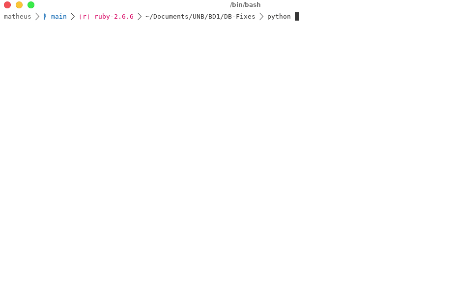
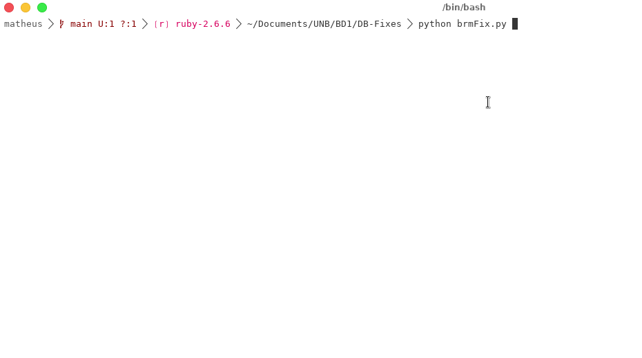

# DB Fixes

Repositório dedicado a scripts que automatizem tarefas da disciplina de
Sistemas de Banco de Dados 1 e 2 da Universidade de Brasília (UNB).

## Populador de tabelas (tuple generator)

Script criado com o intuito de automatizar a tarefa de popular uma tabela com
dados de alta repetitividade como nome, CPF, CNPJ.

### Funcionamento

O script irá solicitar uma série de dados obrigatórios para a geração de um 
script SQL, são esses:

* Nome da tabela
* Quantidade de tuplas que deseja criar
* Atributos das tuplas

este ultimo podendo ser:

| Chave | Resultado | Tamanho necessario para o atributo |
|--|--|--|
| nome | nome gerado aleatoriamente | VARCHAR(20) |
| cpf | cpf gerado aleatoriamente | VARCHAR(15) |
| cnpj | cnpj gerado aleatoriamente | VARCHAR(18) |
| data | Gera uma data aleatoria entre 1980 e 205 | TIME | 
| estado-cidade | Gera dois atributos sendo eles um estado e uma cidade | VARCHAR(2) e VARCHAR(14) |
| random(N) | Gera um atributo inteiro com **N** algarismos **(Use sempre 2 algarismos entre parenteses)** | INTEGER |
| placa | Gera uma placa de carro aleatoriamente | VARCHAR(7) |
| chassi | Gera um chassi de um carro aleatoriamente | VARCHAR(20) |
| cor | Gera uma cor aleatoriamente | VARCHAR(8) |
| telefone | Gera um numero de telefone aleatoriamente | VARCHAR(19) |
| cep | Gera um cep aleatorio | VARCHAR(9) |

## Gerador de constraints (brm Fix)

Script com o intuito de gerar as constraints necessárias para o script de criação do banco de dados.

### Funcionamento

O script solicita apenas o script gerado pelo BR Modelo e produz como saída todas as constraints 
sejam elas **Primary keys** ou **Foreign keys**.

## Gerador do delete (apaga)

Script com o intuito de gerar o script de apaga pedido pelo professor

### Funcionamento

O script solicita apenas o script de criação (fisico) para que ele gere o arquivo apaga e 
mostre no terminal.
